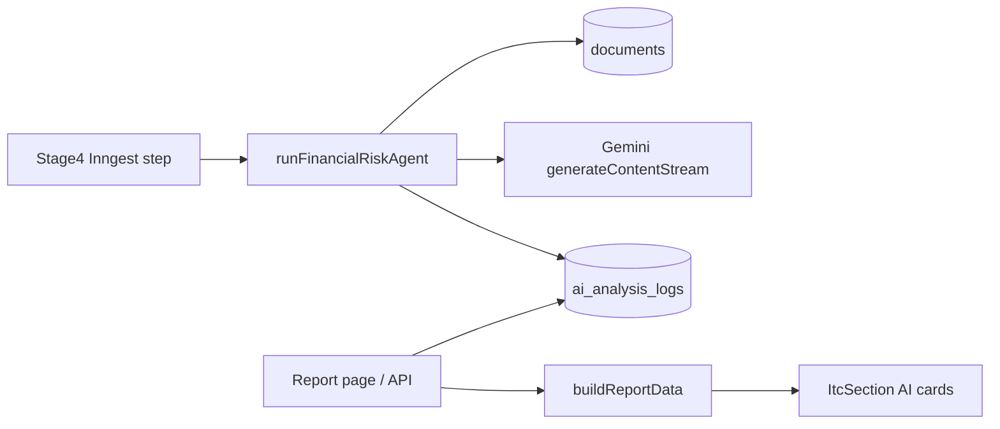

# Financial Risk Agent: Gemini bank-statement analysis, stage 4 Inngest, ai_analysis_logs, ITC report UI

## Overview

We needed **AI-driven bank statement risk analysis** that **does not replace** XDS/ITC bureau data or the existing `risk.agent.ts` aggregated path. The solution is a **dedicated agent** (`financial-risk.agent.ts`), **multi-stage-ready** (`stage` in input; first use is **stage 4**), with **durable storage** in **`ai_analysis_logs`** so downstream stages or reporting can consume the same payload. The **ITC** tab on `/dashboard/risk-review/reports/[id]` renders **additional cards** when the latest log row parses as `{ available: true, ... }`.

## Problem / goal

- **Complement, not substitute:** ITC UI keeps existing bureau-style fields; AI section is clearly labeled and separated.
- **Do not refactor `risk.agent.ts`:** New agent is a separate module and export surface.
- **Bank statement source of truth:** Prefer **`documents`** rows for applicant with `type` in `BANK_STATEMENT` or `BANK_STATEMENT_3_MONTH` (latest by `uploadedAt`), with optional overrides for tests.
- **No hard failure:** Missing statement, missing API key, or model errors must **not** block the workflow; outcomes are still **logged**.
- **Avoid expanding `risk_check_results`:** The hybrid gate expects **four** check types (`PROCUREMENT`, `ITC`, `SANCTIONS`, `FICA`); a fifth type would require coordinated changes to `getHybridGateStatus` / seeding.

## Solution (architecture)

1. **Agent:** [`lib/services/agents/financial-risk.agent.ts`](../../../lib/services/agents/financial-risk.agent.ts)
   - `FINANCIAL_RISK_AGENT_NAME = "financial-risk-agent"`.
   - `runFinancialRiskAgent({ workflowId, applicantId, stage, ... })` — **never throws**; outer `try/catch` + `insertLog` on failure paths.
   - Persists **`rawOutput`** as JSON string: either full success payload with `available: true` or `{ available: false, reason }`.
   - **`promptVersionId`:** `stage-{n}-v1` for traceability across future stages.
   - **Gemini:** `generateContentStream`, `thinkingConfig.thinkingLevel: HIGH`, `mediaResolution: MEDIA_RESOLUTION_MEDIUM`, `responseMimeType: application/json`, `responseJsonSchema` from Zod (`z.toJSONSchema`).
   - **Model:** default `gemini-3-flash-preview`; override with **`FINANCIAL_RISK_GEMINI_MODEL`**.
   - **Auth:** `GOOGLE_GENAI_KEY` via existing [`getGenAIClient`](../../../lib/ai/models.ts) / `isAIConfigured()`.

2. **Inngest:** [`inngest/functions/control-tower/stages/stage4_guardKillSwitch.ts`](../../../inngest/functions/control-tower/stages/stage4_guardKillSwitch.ts) — step `run-financial-risk-agent` immediately after `stage-4-start` (dynamic import of agent to keep cold path clear).

3. **Report assembly:** [`lib/risk-review/build-report-data.ts`](../../../lib/risk-review/build-report-data.ts) — optional 4th argument `financialRiskRawOutput`; [`parseFinancialRiskRawOutput`](../../../lib/risk-review/build-report-data.ts) only sets `bankStatementAnalysis` when parsed `available === true`.

4. **Types:** [`lib/risk-review/types.ts`](../../../lib/risk-review/types.ts) — `bankStatementAnalysis?: FinancialRiskAnalysisResult`.

5. **Data loading:** Latest matching log by `workflowId` + agent name:
   - [`app/(authenticated)/dashboard/risk-review/reports/[id]/page.tsx`](../../../app/(authenticated)/dashboard/risk-review/reports/[id]/page.tsx)
   - [`app/api/risk-review/reports/[id]/route.ts`](../../../app/api/risk-review/reports/[id]/route.ts)

6. **UI:** [`components/dashboard/risk-review/sections/itc-section.tsx`](../../../components/dashboard/risk-review/sections/itc-section.tsx) — divider + balance, cash flow, stability, credit risk cards; [`risk-review-detail.tsx`](../../../components/dashboard/risk-review/risk-review-detail.tsx) passes `bankStatementAnalysis` and includes it in AI briefing context.

7. **Exports:** [`lib/services/agents/index.ts`](../../../lib/services/agents/index.ts).

## Key code references

- Agent entry + persistence: `runFinancialRiskAgent` in [`financial-risk.agent.ts`](../../../lib/services/agents/financial-risk.agent.ts).
- Stage 4 step name: `run-financial-risk-agent` in [`stage4_guardKillSwitch.ts`](../../../inngest/functions/control-tower/stages/stage4_guardKillSwitch.ts).
- UI gate: `bankStatementAnalysis?.available === true` in [`itc-section.tsx`](../../../components/dashboard/risk-review/sections/itc-section.tsx).

## Operational notes

- **Inngest replay:** Each successful step execution can **append** another `ai_analysis_logs` row; the report uses **`orderBy(desc(createdAt)).limit(1)`** — intentional “latest wins.”
- **Empty UI when unavailable:** `available: false` rows are stored for audit but **do not** populate `bankStatementAnalysis` on the report (no empty placeholder cards).
- **XDS / ITC:** Bureau integration and credentials remain separate; see [XDS Connect verification](./2026-03-26-xds-connect-soap-endpoint-login-verification.mdx) for SOAP/login context.

## Prevention & extensions

- **Stage 1 (or others):** Call `runFinancialRiskAgent` with the same signature and a different `stage` value; filter or display by `promptVersionId` / `createdAt` if you need stage-specific rows in UI.
- **Deduping logs:** If replay noise matters, add an application-level idempotency key or upsert strategy — not implemented in the initial version.
- **Verification:** `bun run build`; exercise stage 4 in dev with a workflow that has a bank statement document and `GOOGLE_GENAI_KEY` set, then open the risk report ITC tab.

## Cross-references

- [Inngest workflow stage transitions & browser flow](./2026-03-23-inngest-workflow-stage-transitions-browser-flow-tests.mdx)
- [XDS Connect SOAP / login](./2026-03-26-xds-connect-soap-endpoint-login-verification.mdx)
